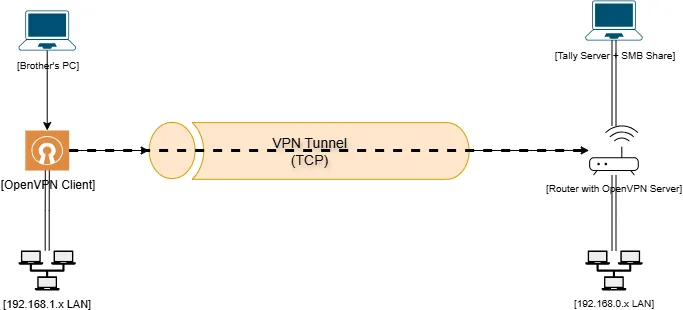
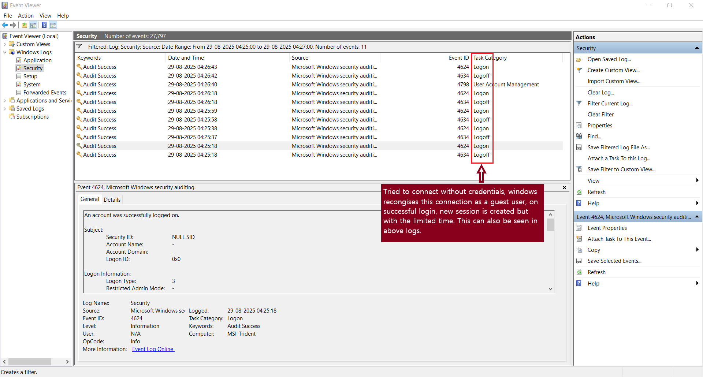

# vpn-remote-access-tally
Secure remote access infrastructure using OpenVPN, SMB, and Tally Prime

# Remote Access Infrastructure for Tally & SMB over OpenVPN

## Project Overview

This project showcases the design and deployment of a secure, bidirectional remote access system using **OpenVPN**, **Windows SMB file sharing**, and **Tally Prime license server routing**. The goal was to enable a remote user (my brother) to access my home PC’s shared folders and Tally license server from a different city (200+ km away) over a VPN tunnel, with full authentication, file transfer, and application-level access.

---

## Skills Demonstrated

- Network architecture & VPN tunnelling (OpenVPN TCP)
- Windows Firewall configuration & port-based access control
- SMB file sharing with credentialed access
- Event Viewer analysis & troubleshooting
- Static routing across subnets
- Tally Prime license server configuration
- Remote collaboration & real-world testing

---
## Repository Structure

<details>
  <summary>Click to expand Repository Structure</summary>

  ```mermaid
    graph TD
    A[vpn-remote-access-tally]
    A --> B[README.md]
    A --> C[configs/]
    C --> C1[server.ovpn]
    C --> C2[client.ovpn]
    C --> C3[TallyGatewayServer.ini]
    A --> D[firewall-rules.md]
    A --> E[troubleshooting-log.md]
    A --> F[screenshots/]
    F --> F1[event-viewer-analysis.png]
    F --> F2[architecture.png]
  ```
</details>

---

## Network Architecture Diagram



---

## Key Components

### VPN Configuration
- Protocol: **TCP** (for reliable file transfer)
- Subnet: `10.8.0.0/24`
- MTU Optimization: `tun-mtu 1400`, `mssfix 1360`
- Static IP assignment for consistent routing

### SMB File Sharing
- Created a **dedicated Windows user** (`vpnuser`) with read/write access
- Shared folders configured for authenticated access
- Mapped network drives from a remote PC using credentials

### Tally License Server Access
- Configured `TallyGatewayServer.ini`:
  ```ini
  ServerPort=10000
  ServerBind=0.0.0.0

- Allowed port 10000 in Windows Firewall
- Verified license fetch over VPN (pending final success)

### Routing & Firewall
Static route added:
- Destination: 192.168.1.0
- Subnet Mask: 255.255.255.0
- Gateway: 10.8.0.14
- Firewall rules scoped to allow traffic from 10.8.0.0/24

---

## Troubleshooting Journey
### SMB Transfer Failure
- Initial file transfers failed with “socket closed” errors
- Diagnosed short-lived SMB sessions via Event Viewer
    

### Guest Account Limitations
- Identified that Guest account caused premature session termination
- Created vpnuser with full access to resolve

### VPN Protocol Optimization
- Switched from UDP to TCP to stabilize large file transfers
- Resulted in successful media file transfer and playback

### Routing Failures
- Static route initially misconfigured with subnet as gateway
- Corrected to use 10.8.0.14 (brother’s VPN IP)
- Enabled IP forwarding on remote PC to allow LAN-to-LAN routing

---

## Current Status
| Component                | Status       | Notes                                                       |
|--------------------------|--------------|-------------------------------------------------------------|
| VPN Tunnel               | ✅ Working   | TCP-based, stable across geographic distance                |
| SMB Access (Mobile)      | ✅ Working   | Successful via mobile file manager with credentials         |
| SMB Access (Remote PC)   | ✅ Working   | Mapping fails due to Windows credential handling            |
| Tally License Access     | ❌ Pending   | Port 10000 reachable, but license fetch not working         |
| Routing to Remote LAN    | ✅ Working   | Static route + IP forwarding enabled                        |

---

## What I Learned

- How to design and secure a multi-subnet VPN infrastructure  
- How Windows handles SMB sessions, authentication, and firewall rules  
- How to debug application-level failures using system logs and network traces  
- How to collaborate remotely and simulate enterprise-grade access control  

---
